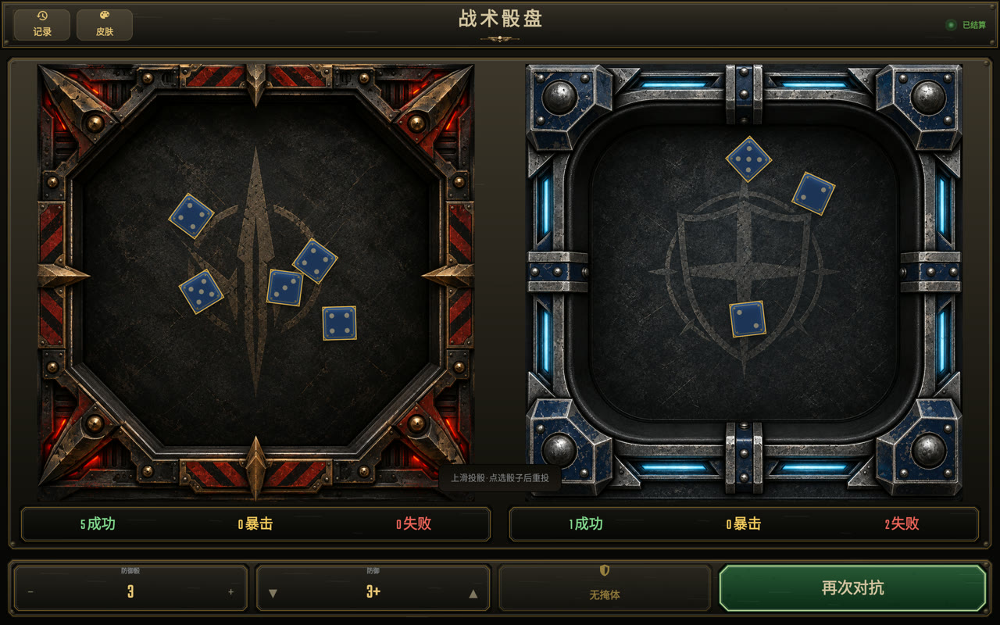
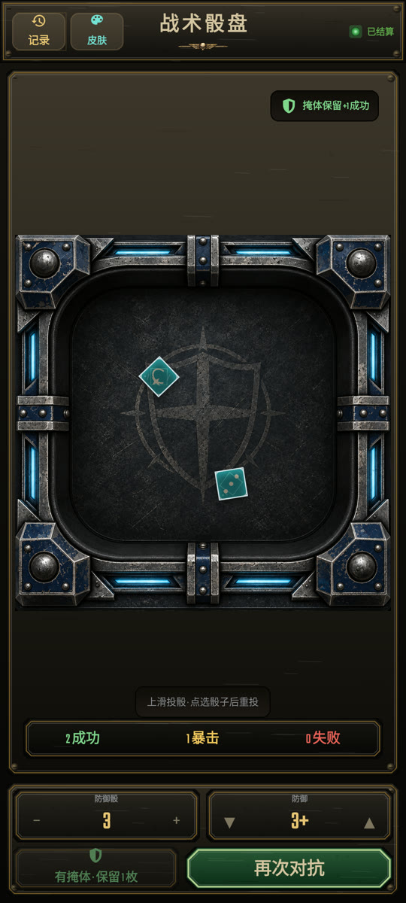

# WHKT Dice

<p align="center">
  <strong>为《杀戮小队》攻防流程设计的 Android 战术骰盘</strong><br>
  攻击与防御成对结算，手机手势切换，平板双盘同屏。
</p>

<p align="center">
  <a href="README.md">简体中文</a> · <a href="README_EN.md">English</a>
</p>

<p align="center">
  
  
  
  
</p>

WHKT Dice 是一款面向桌面战棋玩家的离线 Android 掷骰工具。它不是一个通用随机数按钮集合，而是围绕《杀戮小队》中常见的“先攻击、后防御”流程设计：攻击骰与防御骰的结果会被分别保留，让玩家可以像查看两个真实骰盘一样直接比较双方结果。

> 当前应用界面为简体中文。欢迎贡献英文及其他语言本地化。

## 界面预览

### 平板：攻击与防御双盘同屏

<p align="center">
  
</p>

每个骰盘拥有独立的成功、暴击、失败状态条。完成防御投掷后，攻击与防御结果会同时保留，便于当场比较。

### 手机：滑动查看两个骰盘

<p align="center">
  
</p>

手机端一次只显示一个骰盘，以获得尽可能大的投掷空间。攻击完成后可左右滑动查看攻击盘和防御盘；查看历史骰盘时不会误改当前流程。

## 主要功能

- **成对攻防流程**：先投攻击骰并确认，再进入防御投掷，减少来回配置和误操作。
- **响应式双端布局**：手机通过左右滑动切换并保留骰子位置；平板将两个骰盘并排显示。
- **清晰的结果统计**：成功、暴击、失败使用不同颜色和字重显示；平板为两个骰盘提供独立状态条。
- **掩体规则支持**：防御阶段可启用掩体，并将一枚防御骰保留为普通成功。
- **手势优先操作**：上滑投骰，点选骰子后上滑重投，双指下滑清空结果。
- **实体感投掷体验**：骰子带有运动、碰撞、落定姿态和与动画同步的滚动碰撞音效。
- **攻击与防御视觉区分**：暗红赤铜攻击盘与深蓝冷钢防御盘采用不同轮廓和气氛。
- **投掷记录**：保存完整攻防过程，并突出显示暴击、成功和失败次数；记录中不绑定皮肤。
- **集中式皮肤入口**：界面皮肤统一收纳在一个入口，不占用主要操作空间。
- **离线与本地优先**：无需账号或网络，投掷记录保存在设备本地。

## 操作方式

| 操作 | 手机 | 平板 |
| --- | --- | --- |
| 投掷当前骰子 | 在当前骰盘上滑 | 在当前阶段骰盘上滑 |
| 选择骰子 | 点击骰子 | 点击骰子 |
| 重投所选骰子 | 选中后上滑 | 选中后上滑 |
| 清空当前结果 | 双指下滑 | 双指下滑 |
| 查看另一骰盘 | 攻击确认后左右滑动 | 两个骰盘始终同屏 |
| 开始下一次对抗 | 点击“再次对抗” | 点击“再次对抗” |

## 运行要求

- Android 7.0（API 24）或更高版本
- 推荐使用横屏平板，或竖屏 Android 手机
- 从源码构建需要 JDK 17 与 Android SDK 34

## 从源码构建

```bash
git clone https://github.com/digitalghost/WHKT-dice.git
cd WHKT-dice
./gradlew :app:assembleDebug
```

生成的 APK 位于：

```text
app/build/outputs/apk/debug/app-debug.apk
```

安装到已连接并启用 USB 调试的 Android 设备：

```bash
adb install -r app/build/outputs/apk/debug/app-debug.apk
```

## 测试与检查

```bash
./gradlew :app:testDebugUnitTest
./gradlew :app:lintDebug
./gradlew :app:assembleDebug
```

项目目前包含投掷结果解析和攻防判定逻辑的单元测试，并在手机、平板模拟器及实体 Android 平板上进行界面验证。

## 项目结构

```text
app/src/main/java/com/example/helloworld/
├── MainActivity.kt       # 攻防流程、响应式界面与历史记录交互
├── DiceTrayView.kt       # 骰子绘制、动画、碰撞与手势
├── RollLogic.kt          # 成功、暴击、失败及重投规则
├── RollHistoryStore.kt   # 本地投掷记录
└── DiceSoundPlayer.kt    # 低延迟投骰音效

app/src/main/res/
├── layout/               # 手机布局
├── layout-sw600dp/       # 平板双骰盘布局
└── drawable-nodpi/       # 攻击盘、防御盘及视觉素材
```

## 参与贡献

欢迎提交 Issue 和 Pull Request。适合优先参与的方向包括：

- 英文及其他语言本地化
- 无障碍与屏幕阅读器体验
- 更多设备尺寸适配
- 投掷动画、音效和性能优化
- 针对实际对局流程的易用性反馈

提交代码前，请至少运行单元测试与 Android Lint。

## 免责声明

这是一个由玩家制作的非官方辅助工具，与 Games Workshop 没有隶属、赞助或认可关系。“Warhammer 40,000”“Kill Team”及相关名称和标识属于其各自权利人。本仓库不包含或替代官方规则文本；使用时请以你所拥有的最新版官方规则为准。

## 许可证

项目代码以 [Apache License 2.0](LICENSE) 发布。项目所使用字体的许可文件位于 [`docs/licenses`](docs/licenses)。第三方名称、商标和素材仍归其各自权利人所有。

---

如果这个项目让你的对局更顺畅，欢迎点一个 Star，也欢迎把实际使用中的建议提交到 Issues。
