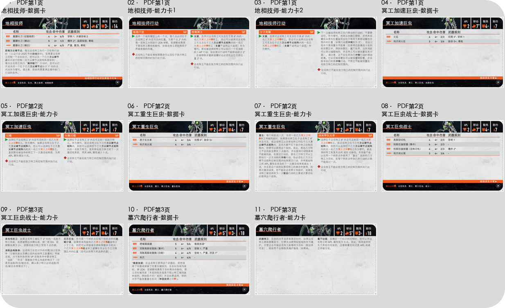
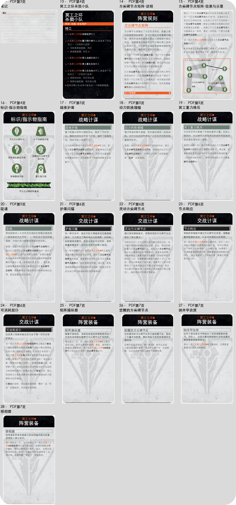

# 冥工之环卡片提取

提取与核对日期：2026-09-24。来源：[冥工之环 Canoptek Circle 杀戮小队规则.pdf](../冥工之环%20Canoptek%20Circle%20杀戮小队规则.pdf)。

200 DPI 整页渲染后裁切；坐标使用 PDF 点坐标（左上原点，x/y/宽/高）。卡框外的白边和裁切线已去除，圆角外为透明 alpha。原卡内容未修改，当前规则以完整资料及 manifest 中正文为准。

[完整规则资料](../冥工之环-完整规则资料.md) · [manifest](manifest.json) · [当前API快照](ktdash-current.json)

| 类别 | 数量 |
|---|---|
| 特工 | 5 |
| 特工能力 | 6 |
| 其他 | 2 |
| 小队选择 | 1 |
| 阵营规则 | 2 |
| 战略计谋 | 4 |
| 交战计谋 | 4 |
| 阵营装备 | 4 |

独立卡片 28 张；另有2张总览，不计入卡片数。

| 编号 | 类别 | 中文标题 / English | 页 | 本地ID | KTDash ID | 状态 |
|---|---|---|---|---|---|---|
| 1 | 特工 | [地相技师-数据卡](01-特工-地相技师-数据卡.png) / Geomancer | 1 | nec-can-card-01 | NEC-CAN-GEO、NEC-CAN-GEO-SNC | current |
| 2 | 特工能力 | [地相技师-能力卡1](02-特工能力-地相技师-能力卡1.png) / Geomancer | 1 | nec-can-card-02 | NEC-CAN-GEO、NEC-CAN-GEO-CC、NEC-CAN-GEO-GD | current |
| 3 | 特工能力 | [地相技师-能力卡2](03-特工能力-地相技师-能力卡2.png) / Geomancer | 1 | nec-can-card-03 | NEC-CAN-GEO、NEC-CAN-GEO-MB | current |
| 4 | 特工 | [冥工加速巨虫-数据卡](04-特工-冥工加速巨虫-数据卡.png) / Canoptek Macrocyte Accelerator | 1 | nec-can-card-04 | NEC-CAN-ACC | current |
| 5 | 特工能力 | [冥工加速巨虫-能力卡](05-特工能力-冥工加速巨虫-能力卡.png) / Canoptek Macrocyte Accelerator | 2 | nec-can-card-05 | NEC-CAN-ACC、NEC-CAN-ACC-CO、NEC-CAN-ACC-OC | current |
| 6 | 特工 | [冥工重生巨虫-数据卡](06-特工-冥工重生巨虫-数据卡.png) / Canoptek Macrocyte Reanimator | 2 | nec-can-card-06 | NEC-CAN-REA | current |
| 7 | 特工能力 | [冥工重生巨虫-能力卡](07-特工能力-冥工重生巨虫-能力卡.png) / Canoptek Macrocyte Reanimator | 2 | nec-can-card-07 | NEC-CAN-REA、NEC-CAN-REA-NB、NEC-CAN-REA-REA | current |
| 8 | 特工 | [冥工巨虫战士-数据卡](08-特工-冥工巨虫战士-数据卡.png) / Canoptek Macrocyte Warrior | 2 | nec-can-card-08 | NEC-CAN-WAR | current |
| 9 | 特工能力 | [冥工巨虫战士-能力卡](09-特工能力-冥工巨虫战士-能力卡.png) / Canoptek Macrocyte Warrior | 3 | nec-can-card-09 | NEC-CAN-WAR、NEC-CAN-WAR-ACS、NEC-CAN-WAR-AD、NEC-CAN-WAR-EC | current |
| 10 | 特工 | [墓穴爬行者-数据卡](10-特工-墓穴爬行者-数据卡.png) / Canoptek Tomb Crawler | 3 | nec-can-card-10 | NEC-CAN-TC、NEC-CAN-TC-DB | current |
| 11 | 特工能力 | [墓穴爬行者-能力卡](11-特工能力-墓穴爬行者-能力卡.png) / Canoptek Tomb Crawler | 3 | nec-can-card-11 | NEC-CAN-TC、NEC-CAN-TC-SF、NEC-CAN-TC-WS | current |
| 12 | 其他 | [笔记](12-其他-笔记.png) / PDF未提供英文标题 | 3 | nec-can-card-12 | null | PDF-only |
| 13 | 小队选择 | [冥工之环杀戮小队](13-小队选择-冥工之环杀戮小队.png) / Canoptek Circle | 4 | nec-can-card-13 | NEC-CAN | current |
| 14 | 阵营规则 | [方尖碑节点矩阵-说明](14-阵营规则-方尖碑节点矩阵-说明.png) / Obelisk Node Matrix | 4 | nec-can-card-14 | NEC-CAN-GEO-ONM、NEC-CAN-ACC-ONM、NEC-CAN-REA-ONM、NEC-CAN-WAR-ONM、NEC-CAN-TC-ONM | current |
| 15 | 阵营规则 | [方尖碑节点矩阵-效果与示意](15-阵营规则-方尖碑节点矩阵-效果与示意.png) / Obelisk Node Matrix | 4 | nec-can-card-15 | NEC-CAN-GEO-ONM、NEC-CAN-ACC-ONM、NEC-CAN-REA-ONM、NEC-CAN-WAR-ONM、NEC-CAN-TC-ONM | current |
| 16 | 其他 | [标识-指示物指南](16-其他-标识-指示物指南.png) / PDF未提供英文标题 | 4 | nec-can-card-16 | null | PDF-only |
| 17 | 战略计谋 | [超维护盾](17-战略计谋-超维护盾.png) / Hypershielding | 5 | nec-can-card-17 | NEC-CAN-S-HS | current |
| 18 | 战略计谋 | [动力转换增幅](18-战略计谋-动力转换增幅.png) / Transdynamic Amplification | 5 | nec-can-card-18 | NEC-CAN-S-TDA | current |
| 19 | 战略计谋 | [冥工重力推斥](19-战略计谋-冥工重力推斥.png) / Cryptogravitic Repulsion | 5 | nec-can-card-19 | NEC-CAN-S-CGR | current |
| 20 | 战略计谋 | [吸魂](20-战略计谋-吸魂.png) / Souldrain | 5 | nec-can-card-20 | NEC-CAN-S-SD | current |
| 21 | 交战计谋 | [护盾闪耀](21-交战计谋-护盾闪耀.png) / Shield Flare | 6 | nec-can-card-21 | NEC-CAN-T-SF | current |
| 22 | 交战计谋 | [灵动方尖碑节点](22-交战计谋-灵动方尖碑节点.png) / Animate Obelisk Nodes | 6 | nec-can-card-22 | NEC-CAN-T-AON | current |
| 23 | 交战计谋 | [节点响应](23-交战计谋-节点响应.png) / Nodal Response | 6 | nec-can-card-23 | NEC-CAN-T-NR | current |
| 24 | 交战计谋 | [可消耗奴仆](24-交战计谋-可消耗奴仆.png) / Sacrificial Thrall | 6 | nec-can-card-24 | NEC-CAN-T-ST | current |
| 25 | 阵营装备 | [矩阵操纵器](25-阵营装备-矩阵操纵器.png) / Matrix Manipulator | 7 | nec-can-card-25 | NEC-CAN-MM | current |
| 26 | 阵营装备 | [觉醒的方尖碑节点](26-阵营装备-觉醒的方尖碑节点.png) / Awakened Obelisk Nodes | 7 | nec-can-card-26 | NEC-CAN-AON | current |
| 27 | 阵营装备 | [纳米甲虫匣](27-阵营装备-纳米甲虫匣.png) / Nanoscarab Caskets | 7 | nec-can-card-27 | NEC-CAN-SDC | current |
| 28 | 阵营装备 | [移相器](28-阵营装备-移相器.png) / Phase Shifter | 7 | nec-can-card-28 | NEC-CAN-PS | current |
