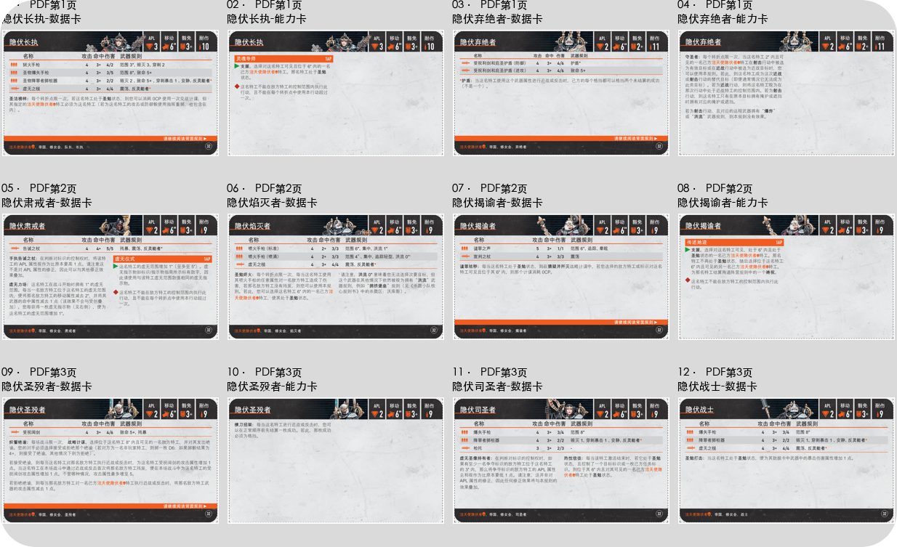
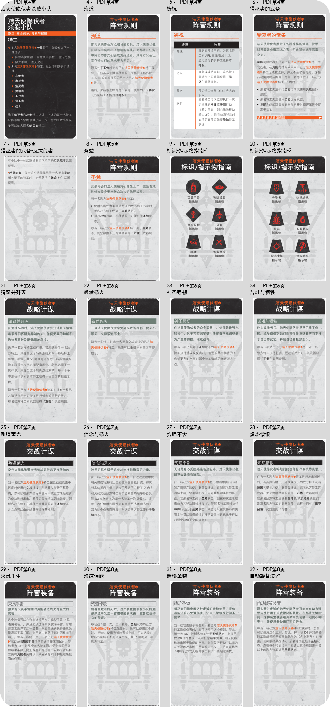

# 洁天使隐伏者卡片提取

提取与核对日期：2026-09-24。来源：[洁天使隐伏者 Celestian Insidiants 杀戮小队规则.pdf](../洁天使隐伏者%20Celestian%20Insidiants%20杀戮小队规则.pdf)。

200 DPI 整页渲染后裁切；坐标使用 PDF 点坐标（左上原点，x/y/宽/高）。卡框外的白边和裁切线已去除，圆角外为透明 alpha。原卡内容未修改，当前规则以完整资料及 manifest 中正文为准。

[完整规则资料](../洁天使隐伏者-完整规则资料.md) · [manifest](manifest.json) · [当前API快照](ktdash-current.json)

| 类别 | 数量 |
|---|---|
| 特工 | 8 |
| 特工能力 | 4 |
| 小队选择 | 1 |
| 阵营规则 | 5 |
| 其他 | 2 |
| 战略计谋 | 4 |
| 交战计谋 | 4 |
| 阵营装备 | 4 |

独立卡片 32 张；另有2张总览，不计入卡片数。

| 编号 | 类别 | 中文标题 / English | 页 | 本地ID | KTDash ID | 状态 |
|---|---|---|---|---|---|---|
| 1 | 特工 | [隐伏长执-数据卡](01-特工-隐伏长执-数据卡.png) / Superior | 1 | imp-ci-card-01 | IMP-CI-SUP、IMP-CI-SUP-HE | current |
| 2 | 特工能力 | [隐伏长执-能力卡](02-特工能力-隐伏长执-能力卡.png) / Superior | 1 | imp-ci-card-02 | IMP-CI-SUP、IMP-CI-SUP-SM | current |
| 3 | 特工 | [隐伏弃绝者-数据卡](03-特工-隐伏弃绝者-数据卡.png) / Abjuror | 1 | imp-ci-card-03 | IMP-CI-ABJ、IMP-CI-ABJ-SH | current |
| 4 | 特工能力 | [隐伏弃绝者-能力卡](04-特工能力-隐伏弃绝者-能力卡.png) / Abjuror | 1 | imp-ci-card-04 | IMP-CI-ABJ、IMP-CI-ABJ-HD | current |
| 5 | 特工 | [隐伏肃戒者-数据卡](05-特工-隐伏肃戒者-数据卡.png) / Censor | 2 | imp-ci-card-05 | IMP-CI-CEN、IMP-CI-CEN-NF、IMP-CI-CEN-NR、IMP-CI-CEN-VOAIB | current |
| 6 | 特工 | [隐伏焰灭者-数据卡](06-特工-隐伏焰灭者-数据卡.png) / Cremator | 2 | imp-ci-card-06 | IMP-CI-CRE、IMP-CI-CRE-T0、IMP-CI-CRE-IP | current |
| 7 | 特工 | [隐伏揭谕者-数据卡](07-特工-隐伏揭谕者-数据卡.png) / Denuncia | 2 | imp-ci-card-07 | IMP-CI-DEN、IMP-CI-DEN-AE | current |
| 8 | 特工能力 | [隐伏揭谕者-能力卡](08-特工能力-隐伏揭谕者-能力卡.png) / Denuncia | 2 | imp-ci-card-08 | IMP-CI-DEN、IMP-CI-DEN-SOHD | current |
| 9 | 特工 | [隐伏圣殁者-数据卡](09-特工-隐伏圣殁者-数据卡.png) / Mortisanctus | 3 | imp-ci-card-09 | IMP-CI-MOR、IMP-CI-MOR-ZU | current |
| 10 | 特工能力 | [隐伏圣殁者-能力卡](10-特工能力-隐伏圣殁者-能力卡.png) / Mortisanctus | 3 | imp-ci-card-10 | IMP-CI-MOR、IMP-CI-MOR-BS | current |
| 11 | 特工 | [隐伏司圣者-数据卡](11-特工-隐伏司圣者-数据卡.png) / Reliquarius | 3 | imp-ci-card-11 | IMP-CI-REL、IMP-CI-REL-DEV、IMP-CI-REL-SNIB | current |
| 12 | 特工 | [隐伏战士-数据卡](12-特工-隐伏战士-数据卡.png) / Warrior | 3 | imp-ci-card-12 | IMP-CI-WAR、IMP-CI-WAR-IS | current |
| 13 | 小队选择 | [洁天使隐伏者杀戮小队](13-小队选择-洁天使隐伏者杀戮小队.png) / Celestian Insidiants | 4 | imp-ci-card-13 | IMP-CI | current |
| 14 | 阵营规则 | [殉道](14-阵营规则-殉道.png) / Martyrdom | 4 | imp-ci-card-14 | IMP-CI-SUP-MAR、IMP-CI-ABJ-MAR、IMP-CI-CEN-MAR、IMP-CI-CRE-MAR、IMP-CI-DEN-MAR、IMP-CI-MOR-MAR、IMP-CI-REL-MAR、IMP-CI-WAR-MAR | current |
| 15 | 阵营规则 | [祷祝](15-阵营规则-祷祝.png) / Benedictions | 4 | imp-ci-card-15 | IMP-CI-SUP-BEN、IMP-CI-ABJ-BEN、IMP-CI-CEN-BEN、IMP-CI-CRE-BEN、IMP-CI-DEN-BEN、IMP-CI-MOR-BEN、IMP-CI-REL-BEN、IMP-CI-WAR-BEN | current |
| 16 | 阵营规则 | [猎巫者的武备](16-阵营规则-猎巫者的武备.png) / Weapons Of The Witch Hunters | 4 | imp-ci-card-16 | IMP-CI-SUP-WOTWH、IMP-CI-ABJ-WOTWH、IMP-CI-CEN-WOTWH、IMP-CI-CRE-WOTWH、IMP-CI-DEN-WOTWH、IMP-CI-MOR-WOTWH、IMP-CI-REL-WOTWH、IMP-CI-WAR-WOTWH | current |
| 17 | 阵营规则 | [猎巫者的武备-反灵能者](17-阵营规则-猎巫者的武备-反灵能者.png) / Anti-PSYKER | 5 | imp-ci-card-17 | null | PDF-only |
| 18 | 阵营规则 | [圣勉](18-阵营规则-圣勉.png) / Inspiration | 5 | imp-ci-card-18 | IMP-CI-SUP-INS、IMP-CI-ABJ-INS、IMP-CI-CEN-INS、IMP-CI-CRE-INS、IMP-CI-DEN-INS、IMP-CI-MOR-INS、IMP-CI-REL-INS、IMP-CI-WAR-INS | current |
| 19 | 其他 | [标识-指示物指南-1](19-其他-标识-指示物指南-1.png) / PDF未提供英文标题 | 5 | imp-ci-card-19 | null | PDF-only |
| 20 | 其他 | [标识-指示物指南-2](20-其他-标识-指示物指南-2.png) / PDF未提供英文标题 | 5 | imp-ci-card-20 | null | PDF-only |
| 21 | 战略计谋 | [猜疑并歼灭](21-战略计谋-猜疑并歼灭.png) / Suspect & Eliminate | 6 | imp-ci-card-21 | IMP-CI-SAI | current |
| 22 | 战略计谋 | [毅然怒火](22-战略计谋-毅然怒火.png) / Wrathful Determination | 6 | imp-ci-card-22 | IMP-CI-WD | current |
| 23 | 战略计谋 | [神圣强韧](23-战略计谋-神圣强韧.png) / Holy Resilience | 6 | imp-ci-card-23 | IMP-CI-HR | current |
| 24 | 战略计谋 | [苦难与牺牲](24-战略计谋-苦难与牺牲.png) / Suffering & Sacrifice | 6 | imp-ci-card-24 | IMP-CI-SAS | current |
| 25 | 交战计谋 | [殉道荣光](25-交战计谋-殉道荣光.png) / Glory To The Martyrs | 7 | imp-ci-card-25 | IMP-CI-GTTM | current |
| 26 | 交战计谋 | [信念与怒火](26-交战计谋-信念与怒火.png) / Faith & Fury | 7 | imp-ci-card-26 | IMP-CI-FAF | current |
| 27 | 交战计谋 | [穷追不舍](27-交战计谋-穷追不舍.png) / Unshakeable Pursuit | 7 | imp-ci-card-27 | IMP-CI-UP | current |
| 28 | 交战计谋 | [炽热憎恨](28-交战计谋-炽热憎恨.png) / Fervent Hate | 7 | imp-ci-card-28 | IMP-CI-FH | current |
| 29 | 阵营装备 | [灭灵手雷](29-阵营装备-灭灵手雷.png) / Psyk-Out Grenades | 8 | imp-ci-card-29 | IMP-CI-POG | current |
| 30 | 阵营装备 | [殉道悼歌](30-阵营装备-殉道悼歌.png) / Vocifera Mortis | 8 | imp-ci-card-30 | IMP-CI-VM | current |
| 31 | 阵营装备 | [遗珍圣物](31-阵营装备-遗珍圣物.png) / Saintly Relics | 8 | imp-ci-card-31 | IMP-CI-SR | current |
| 32 | 阵营装备 | [自动鞭笞装置](32-阵营装备-自动鞭笞装置.png) / Auto-Flagellator | 8 | imp-ci-card-32 | IMP-CI-AF | current |
