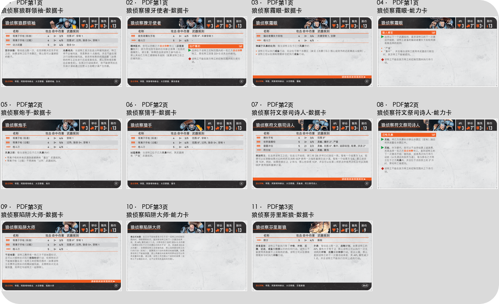
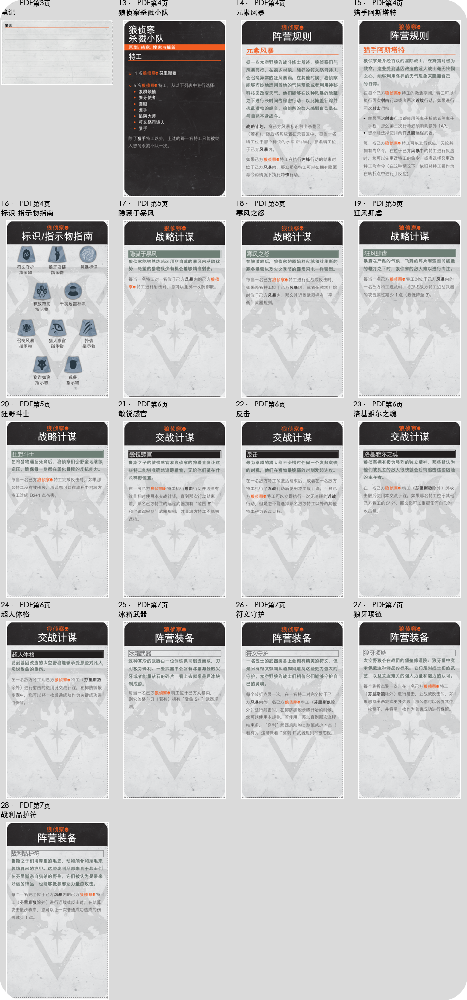

# 狼侦察卡片提取

提取与核对日期：2026-09-24。来源：[狼侦察杀戮小队 Wolf Scouts 杀戮小队规则.pdf](../狼侦察杀戮小队%20Wolf%20Scouts%20杀戮小队规则.pdf)。

200 DPI 整页渲染后裁切；坐标使用 PDF 点坐标（左上原点，x/y/宽/高）。卡框外的白边和裁切线已去除，圆角外为透明 alpha。原卡内容未修改，当前规则以完整资料及 manifest 中正文为准。

[完整规则资料](../狼侦察-完整规则资料.md) · [manifest](manifest.json) · [当前API快照](ktdash-current.json)

| 类别 | 数量 |
|---|---|
| 特工 | 8 |
| 特工能力 | 3 |
| 其他 | 2 |
| 小队选择 | 1 |
| 阵营规则 | 2 |
| 战略计谋 | 4 |
| 交战计谋 | 4 |
| 阵营装备 | 4 |

独立卡片 28 张；另有2张总览，不计入卡片数。

| 编号 | 类别 | 中文标题 / English | 页 | 本地ID | KTDash ID | 状态 |
|---|---|---|---|---|---|---|
| 1 | 特工 | [狼侦察狼群领袖-数据卡](01-特工-狼侦察狼群领袖-数据卡.png) / Pack Leader | 1 | imp-ws-card-01 | IMP-WS-LDR、IMP-WS-LDR-GV、IMP-WS-LDR-LG | current |
| 2 | 特工 | [狼侦察獠牙使者-数据卡](02-特工-狼侦察獠牙使者-数据卡.png) / Fangbearer | 1 | imp-ws-card-02 | IMP-WS-FB、IMP-WS-FB-HB、IMP-WS-FB-SC | current |
| 3 | 特工 | [狼侦察霜眼-数据卡](03-特工-狼侦察霜眼-数据卡.png) / Frosteye | 1 | imp-ws-card-03 | IMP-WS-FE、IMP-WS-FE-SVE | current |
| 4 | 特工能力 | [狼侦察霜眼-能力卡](04-特工能力-狼侦察霜眼-能力卡.png) / Frosteye | 1 | imp-ws-card-04 | IMP-WS-FE、IMP-WS-FE-HS | current |
| 5 | 特工 | [狼侦察炮手-数据卡](05-特工-狼侦察炮手-数据卡.png) / Gunner | 2 | imp-ws-card-05 | IMP-WS-GNR、IMP-WS-GNR-TF | current |
| 6 | 特工 | [狼侦察猎手-数据卡](06-特工-狼侦察猎手-数据卡.png) / Hunter | 2 | imp-ws-card-06 | IMP-WS-HNT、IMP-WS-HNT-FT | current |
| 7 | 特工 | [狼侦察符文祭司诗人-数据卡](07-特工-狼侦察符文祭司诗人-数据卡.png) / Rune Priest Skjald | 2 | imp-ws-card-07 | IMP-WS-RP、IMP-WS-RP-CTR | current |
| 8 | 特工能力 | [狼侦察符文祭司诗人-能力卡](08-特工能力-狼侦察符文祭司诗人-能力卡.png) / Rune Priest Skjald | 2 | imp-ws-card-08 | IMP-WS-RP、IMP-WS-RP-CTS | current |
| 9 | 特工 | [狼侦察陷阱大师-数据卡](09-特工-狼侦察陷阱大师-数据卡.png) / Trapmaster | 3 | imp-ws-card-09 | IMP-WS-TM、IMP-WS-TM-HWM | current |
| 10 | 特工能力 | [狼侦察陷阱大师-能力卡](10-特工能力-狼侦察陷阱大师-能力卡.png) / Trapmaster | 3 | imp-ws-card-10 | IMP-WS-TM、IMP-WS-TM-PM | current |
| 11 | 特工 | [狼侦察芬里斯狼-数据卡](11-特工-狼侦察芬里斯狼-数据卡.png) / Fenrisian Wolf | 3 | imp-ws-card-11 | IMP-WS-WLF、IMP-WS-WLF-IP、IMP-WS-WLF-P | current |
| 12 | 其他 | [笔记](12-其他-笔记.png) / PDF未提供英文标题 | 3 | imp-ws-card-12 | null | PDF-only |
| 13 | 小队选择 | [狼侦察杀戮小队](13-小队选择-狼侦察杀戮小队.png) / Wolf Scouts | 4 | imp-ws-card-13 | IMP-WS | current |
| 14 | 阵营规则 | [元素风暴](14-阵营规则-元素风暴.png) / Elemental Storm | 4 | imp-ws-card-14 | IMP-WS-LDR-ES、IMP-WS-FB-ES、IMP-WS-FE-ES、IMP-WS-GNR-ES、IMP-WS-HNT-ES、IMP-WS-RP-ES、IMP-WS-TM-ES、IMP-WS-WLF-ES | current |
| 15 | 阵营规则 | [猎手阿斯塔特](15-阵营规则-猎手阿斯塔特.png) / Hunting Astartes | 4 | imp-ws-card-15 | IMP-WS-LDR-HA、IMP-WS-FB-HA、IMP-WS-FE-HA、IMP-WS-GNR-HA、IMP-WS-HNT-HA、IMP-WS-RP-HA、IMP-WS-TM-HA、IMP-WS-WLF-HA | current |
| 16 | 其他 | [标识-指示物指南](16-其他-标识-指示物指南.png) / PDF未提供英文标题 | 4 | imp-ws-card-16 | null | PDF-only |
| 17 | 战略计谋 | [隐藏于暴风](17-战略计谋-隐藏于暴风.png) / Cloaked By The Storm | 5 | imp-ws-card-17 | IMP-WS-CBTS | current |
| 18 | 战略计谋 | [寒风之怒](18-战略计谋-寒风之怒.png) / Tempestuous Wrath | 5 | imp-ws-card-18 | IMP-WS-TW | current |
| 19 | 战略计谋 | [狂风肆虐](19-战略计谋-狂风肆虐.png) / Storm's Bite | 5 | imp-ws-card-19 | IMP-WS-SB | current |
| 20 | 战略计谋 | [狂野斗士](20-战略计谋-狂野斗士.png) / Savage Fighters | 5 | imp-ws-card-20 | IMP-WS-SF | current |
| 21 | 交战计谋 | [敏锐感官](21-交战计谋-敏锐感官.png) / Acute Senses | 6 | imp-ws-card-21 | IMP-WS-AS | current |
| 22 | 交战计谋 | [反击](22-交战计谋-反击.png) / Counterattack | 6 | imp-ws-card-22 | IMP-WS-CA | current |
| 23 | 交战计谋 | [洛基雅尔之魂](23-交战计谋-洛基雅尔之魂.png) / Touched By Lokyar | 6 | imp-ws-card-23 | IMP-WS-TBL | current |
| 24 | 交战计谋 | [超人体格](24-交战计谋-超人体格.png) / Transhuman Physiology | 6 | imp-ws-card-24 | IMP-WS-THP | current |
| 25 | 阵营装备 | [冰霜武器](25-阵营装备-冰霜武器.png) / Frost Weapons | 7 | imp-ws-card-25 | IMP-WS-FW | current |
| 26 | 阵营装备 | [符文守护](26-阵营装备-符文守护.png) / Runic Charms | 7 | imp-ws-card-26 | IMP-WS-RC | current |
| 27 | 阵营装备 | [狼牙项链](27-阵营装备-狼牙项链.png) / Wolfteeth Necklaces | 7 | imp-ws-card-27 | IMP-WS-WTNL | current |
| 28 | 阵营装备 | [战利品护符](28-阵营装备-战利品护符.png) / Talismanic Trophies | 7 | imp-ws-card-28 | IMP-WS-TT | current |
